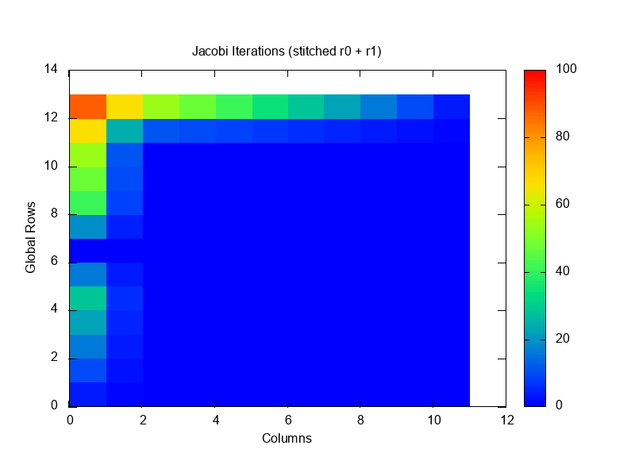
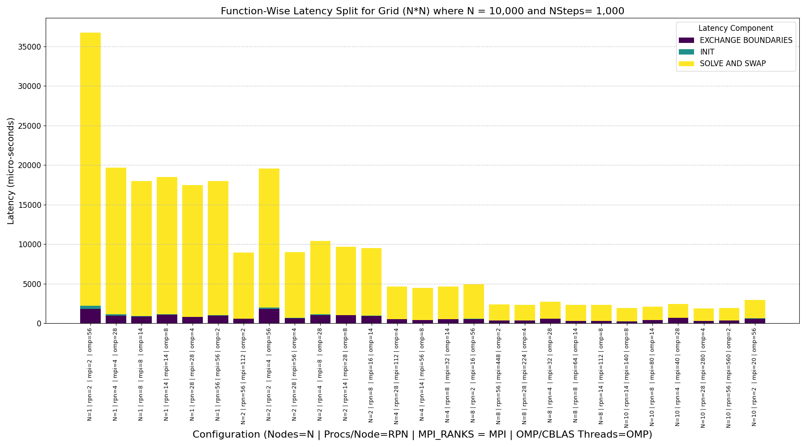
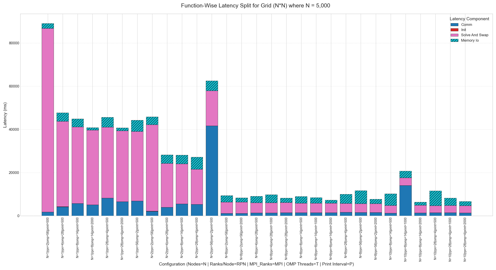

# jacobi-poisson-solver


The same 2-D Laplace problem in three parallel models — MPI + OpenMP, the same with collective HDF5
checkpointing, and MPI + OpenACC — plus NVIDIA's NVSHMEM multi-GPU sample for comparison, to see how each
behaves when you actually scale it, and what it costs to write files while you do.

<p align="center">
  
</p>

<p align="center"><sub>Heat relaxing from a hot corner. Stitched back together from two MPI ranks —
each rank owns a row block and writes its own slab, and the animation reassembles them, so this is also
a check that the decomposition and the I/O agree.</sub></p>

| Variant | Model | What it adds | Benchmarked to |
|---|---|---|---|
| [`mpi-openmp/`](mpi-openmp/) | MPI + OpenMP | Baseline hybrid — `#pragma omp parallel for collapse(2) schedule(static)` over the stencil | 1120 cores / 10 nodes |
| [`mpi-openmp-hdf5/`](mpi-openmp-hdf5/) | + parallel HDF5 | Collective writes from every rank into one shared `.h5`, at a configurable step interval | 1120 cores / 10 nodes |
| [`mpi-openacc/`](mpi-openacc/) | MPI + OpenACC | GPU offload with explicit data regions; halos sent straight out of device memory | 40 × A100 / 10 nodes |
| [`nvshmem/`](nvshmem/) | NVSHMEM | NVIDIA's multi-GPU Jacobi sample (MIT licence, copyright header kept), built and studied: GPU-initiated halo exchange, no MPI in the inner loop | not benchmarked |

**What the runs showed**

- **94% node-to-node efficiency out to 1120 cores** — 9.38× from 1 to 10 full nodes, halo exchange
  staying under 15% of runtime. This is a scaling study of an **`-O0` build**, measured against one full
  node rather than a serial run.
- **The rank/thread split is worth 2×**, at nearly every node count. Same cores, same binary, 2.08×
  apart. Few ranks × many threads always loses to NUMA.
- **Checkpointing changes which configuration is fastest.** The config with the quickest compute has
  the slowest total time once writes are counted — by 34%.
- **GPU scaling stalls around 16 A100s** at this problem size: compute keeps shrinking, communication
  doesn't.

**Stack:** C++20 · MPI · OpenMP · OpenACC · NVSHMEM · HDF5 · Docker · Nsight Systems · SLURM

**Where it ran:** Leonardo at CINECA — DCGP partition for CPU runs (112 cores per node, 2× Intel
Sapphire Rapids) and Booster for GPU runs (4× A100 64 GB per node, 200 Gbps HDR InfiniBand).

## The problem

Jacobi iteration on a 2-D grid — every cell becomes the average of its four neighbours, repeat until it
relaxes.

```
u_new[i][j] = 0.25 * (u_old[i-1][j] + u_old[i+1][j] + u_old[i][j-1] + u_old[i][j+1])
```

Why it's the standard model problem for stencil codes:

- Trivial arithmetic — nothing hides behind clever maths
- Heavy memory traffic — you measure the memory system, not the FPUs
- A halo exchange every single step — communication cost shows up immediately

| Property | Value |
|---|---|
| Precision | `double` (`CMesh<double>`), 8 bytes |
| Decomposition | 1-D row-block across MPI ranks, one halo row each side |
| Halo exchange | Two `MPI_Sendrecv` calls per step; `mpi_dt.hpp` maps the C++ element type to its MPI datatype at compile time |
| Arithmetic intensity | 5 flop per cell, ≥16 B compulsory traffic → **0.31 flop/byte** |

→ **Bandwidth-bound, not compute-bound.** Nothing below is limited by FPU throughput.

How each GPU variant handles halos:

| Variant | Halo path |
|---|---|
| `mpi-openacc` | `#pragma acc host_data use_device(...)` — GPU-aware MPI moves buffers device-to-device, no host staging |
| `nvshmem` | No MPI in the inner loop at all; the GPU initiates the exchange itself |

## CPU scaling — N = 10,000², 1000 steps

> **Compiled `-O0 -g`.** Built without optimisation, so these wall-clock times are **not** a performance
> result — a `-O3` build is several times faster. Every configuration used the same binary, so the
> *scaling* and the rank/thread comparison are valid. The unoptimised compute also makes communication a
> smaller share of each run, which flatters the efficiency; expect lower efficiency at `-O3`.

Two 0.75 GiB fields. Best configuration at each node count, solve plus halo exchange. Speed-up and
efficiency are relative to **one full node** (112 cores).

| Nodes | Cores | Best config | Solve | Halo | Total | Speedup | Efficiency |
|---:|---:|---|---:|---:|---:|---:|---:|
| 1 | 112 | 28 ranks × 4 threads | 16.65 s | 0.79 s | 17.44 s | 1× | — |
| 2 | 224 | 112 ranks × 2 threads | 8.36 s | 0.56 s | 8.92 s | 1.95× | 98% |
| 4 | 448 | 56 ranks × 8 threads | 4.08 s | 0.41 s | 4.49 s | 3.89× | 97% |
| 8 | 896 | 112 ranks × 8 threads | 2.02 s | 0.31 s | 2.33 s | 7.48× | 93% |
| 10 | 1120 | 280 ranks × 4 threads | 1.59 s | 0.27 s | 1.86 s | **9.38×** | 94% |

→ **94% efficiency from 1 to 10 nodes** (node baseline, `-O0`). Halo exchange stays under 15% of
runtime throughout.



### The rank/thread split is worth 2×

| Nodes | Best | Worst | Spread |
|---:|---|---|---:|
| 1 | 28×4 — 17.44 s | 2×56 — 36.36 s | 2.08× |
| 2 | 112×2 — 8.92 s | 4×56 — 19.35 s | 2.17× |
| 8 | 112×8 — 2.33 s | 16×56 — 4.90 s | 2.10× |
| 10 | 280×4 — 1.86 s | 20×56 — 2.93 s | 1.58× |

- Same nodes, same cores, same binary — 2× apart
- **Few ranks × many threads always loses.** A rank spanning both sockets keeps touching memory
  attached to the other one
- **Many ranks × 2–8 threads wins.** Every thread stays in its own NUMA domain
- Jobs set `OMP_PROC_BIND=close` and `OMP_PLACES=cores` for exactly this reason

## Parallel I/O — what checkpointing costs

> **Different problem size: N = 5,000², not 10,000².**

The HDF5 variant writes every rank's slab collectively into one shared `.h5` file, at a configurable
step interval. 27 configurations, four latency components:



### Writing less often helps roughly linearly

8 nodes, 8 ranks × 14 threads:

| Write every | I/O time | Solve time |
|---:|---:|---:|
| 500 steps | 3155 ms | 4359 ms |
| 1000 steps | 2555 ms | 4369 ms |
| 2000 steps | 1411 ms | 4384 ms |

→ Solve time doesn't move. The writes are purely additive, not perturbing the compute.

### More ranks means more I/O contention — and that flips the optimum

8 nodes, writing every 500 steps:

| Ranks/node | Solve | I/O | Total |
|---:|---:|---:|---:|
| 2 | 5126 ms | 3060 ms | 8186 ms |
| 4 | 4694 ms | 2973 ms | 7666 ms |
| **8** | 4359 ms | 3155 ms | **7514 ms** |
| 28 | 4055 ms | 4222 ms | 8277 ms |
| 56 | **3999 ms** | 6071 ms | 10071 ms |

- 56 ranks/node has the **fastest compute** of any configuration
- 56 ranks/node also has the **slowest total**, by 34%
- More ranks means more concurrent writers on the parallel filesystem
- Past ~8 ranks/node, contention grows faster than the compute savings

→ **Tuning on compute time alone picks the wrong configuration.** You have to measure the I/O.

## GPU scaling — N = 20,000², 1000 steps

> **Not comparable to the CPU tables** — 4× the grid, and built `-O3 -acc -gpu=cc80` where the CPU runs
> were `-O0`.

Two 2.98 GiB fields.

| GPUs | Nodes | Time | GFLOP/s | Speedup | Efficiency | Field per GPU |
|---:|---:|---:|---:|---:|---:|---:|
| 4 | 1 | 6.695 s | 299 | 1× | 100% | 1.49 GiB |
| 8 | 2 | 4.025 s | 497 | 1.66× | 83% | 0.75 GiB |
| 16 | 4 | 2.694 s | 742 | 2.49× | 62% | 0.37 GiB |
| 40 | 10 | 1.887 s | 1060 | 3.55× | 36% | 0.15 GiB |


- Compute time drops with more GPUs; **communication stays roughly flat**
- By 40 GPUs the halo exchange is most of the runtime
- Each card then holds only 150 MiB — not enough work to cover the exchange
- Classic strong-scaling wall. Fixes: a bigger problem, or overlap the exchange with compute

Nsight traces are in [`results/gpu/`](results/gpu/), collected with
[`scripts/slurm/nsys_profile.sh`](scripts/slurm/nsys_profile.sh).

## Build and run

- Each variant is standalone
- All read a plain-text config from [`input/`](input/): grid size, corner value, initial fill, step count
- SLURM scripts for every variant are in [`scripts/slurm/`](scripts/slurm/)
- Output goes to `files/` as one `.dat` per rank per step
- `gnuplot results/analysis/animate_jacobi.gp` stitches the ranks together and renders the animation at the top of this README
- The OpenACC build has a [`Dockerfile`](mpi-openacc/Dockerfile) if you'd rather not install the NVIDIA HPC SDK

**MPI + OpenMP**

```bash
mpic++ -O3 -std=c++20 -fopenmp -Impi-openmp/include mpi-openmp/src/main.cpp -o jacobi.x
OMP_NUM_THREADS=4 mpirun -n 28 ./jacobi.x input/mpi_openmp.in
```

**MPI + OpenMP + HDF5**

```bash
mpic++ -O3 -std=c++20 -fopenmp -Impi-openmp-hdf5/include \
  -I${HDF5_INCLUDE} -L${HDF5_LIB} -lhdf5_cpp -lhdf5 \
  mpi-openmp-hdf5/src/main.cpp -o jacobi_io.x
OMP_NUM_THREADS=4 mpirun -n 8 ./jacobi_io.x input/mpi_openmp_hdf5.in
h5ls -r files/jacobi.h5      # inspect the output
```

**MPI + OpenACC** — needs the NVIDIA HPC SDK

```bash
mpic++ -O3 -std=c++20 -acc -gpu=cc80 -Minfo=accel -Impi-openacc/include \
  mpi-openacc/src/main.cpp -o jacobi_gpu.x
mpirun -n 4 ./jacobi_gpu.x input/mpi_openacc.in
```

## Known issues and corrections

Re-checked against the source and [`results/`](results/) in **September 2026**:

| # | Found | Issue | Status |
|---|---|---|---|
| 1 | Sep 2026 | **"94% parallel efficiency at 1120 cores"** implied a serial baseline. It is measured from **one full node** (112 cores) to ten, on an **`-O0`** build — and unoptimised compute inflates efficiency by shrinking communication's share of the run | **Corrected** wherever the number appears, with baseline and build stated alongside |
| 2 | Sep 2026 | **The halo exchange was described as "custom MPI derived datatypes".** It is two `MPI_Sendrecv` calls per step; `mpi_dt.hpp` is a compile-time map from the C++ element type to its `MPI_Datatype` — a type trait, not a derived datatype | **Corrected** |
| 3 | Sep 2026 | **The NVSHMEM variant is NVIDIA's multi-GPU Jacobi sample**, kept with its original copyright header, but the repo read as four implementations of mine | **Attributed.** Now three models plus a studied sample |
| 4 | Sep 2026 | **`tests/` don't build.** They target `boundary.hpp` / `solver.hpp`, which no longer exist | **Documented as legacy.** Correctness was checked by stitching per-rank output and diffing against a single-rank run |

**On #1:** the measurement was never wrong — 9.38× from 1 to 10 nodes is what the logs say. What was
wrong was letting "94% efficiency" stand without the baseline beside it, since the phrase normally
means efficiency against serial. An `-O0` scaling study is a legitimate thing to publish; it just has
to say what it is in the same breath as the number.

**Still open**

- **Re-run at `-O3`.** The honest expectation is *lower* efficiency, because optimised compute makes
  the halo exchange a larger fraction of each step. That number is the interesting one and doesn't
  exist yet
- **Benchmark the NVSHMEM variant.** It builds and runs; it was never scaled
- **Rewrite `tests/`** against the current headers and wire them into CTest, so correctness stops
  depending on a manual stitching step

## Caveats

| Caveat | Detail |
|---|---|
| **Timer unit label is wrong** | `timer.hpp` casts to `microseconds` but prints `ms`. Everything in [`results/`](results/) is microseconds — verified against the wall-clock stamps in the same files, and converted correctly in every table here. Left as-is so published numbers match raw output |
| **CPU runs are `-O0`** | Treat those wall-clock times as a scaling study, not a performance result. Efficiency is relative to one full node, and unoptimised compute flatters it |
| **Three different problem sizes** | 10,000² hybrid CPU · 5,000² I/O · 20,000² GPU. Don't read across the tables |
| **NVSHMEM variant is NVIDIA's sample** | Kept with its original copyright header; no scaling runs of its own |
| **`tests/` are legacy** | They were written against an earlier version of the headers (`boundary.hpp`, `solver.hpp`) and don't build against the current code. Correctness was checked by stitching per-rank output back together and comparing with a single-rank run |

## Layout

```
mpi-openmp/            MPI + OpenMP baseline
mpi-openmp-hdf5/       + collective HDF5 checkpointing
mpi-openacc/           GPU offload, + Dockerfile
nvshmem/               GPU-initiated halo exchange (NVIDIA sample)
input/                 run configurations
scripts/slurm/         batch scripts, Nsight profiling
results/
  cpu/  io/  gpu/      raw timing output
  plots/               figures and the animation used above
  analysis/            plotting and animation scripts
  exam-report.md       full write-up with raw run tables
```

Each variant carries its own `include/` (and a legacy `tests/`, see Caveats):

| Header | Contents |
|---|---|
| `mesh.hpp` | Solver and halo logic |
| `mpi_dt.hpp` | Compile-time mapping from the C++ element type to its `MPI_Datatype` |
| `timer.hpp` | Per-rank function timing |
| `printer.hpp` | Field output |
| `parallel_jacobi_write.hpp` | Collective HDF5 writes (HDF5 variant only) |

## Where this came from

| | |
|---|---|
| Course | Master in High Performance Computing, ICTP / SISSA Trieste, 2025–26 |
| Hybrid + I/O variants | *P1.5 Parallel Programming* |
| GPU variants | *P1.7 GPU Programming*, *P2.2 GPU Programming 2* |
| Full write-up | [`results/exam-report.md`](results/exam-report.md) — raw run tables behind every figure |
| Already public since June 2026 | [`prabhkodes/heterogenous_computing`](https://github.com/prabhkodes/heterogenous_computing), [`prabhkodes/file_io_stuff`](https://github.com/prabhkodes/file_io_stuff) |
| Course repositories | Belong to SISSA, private |
