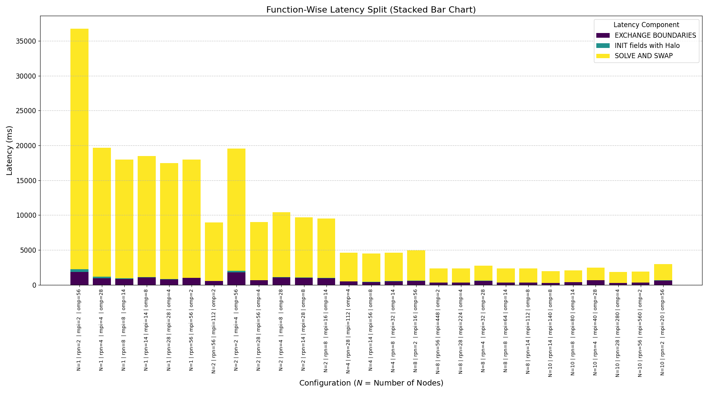
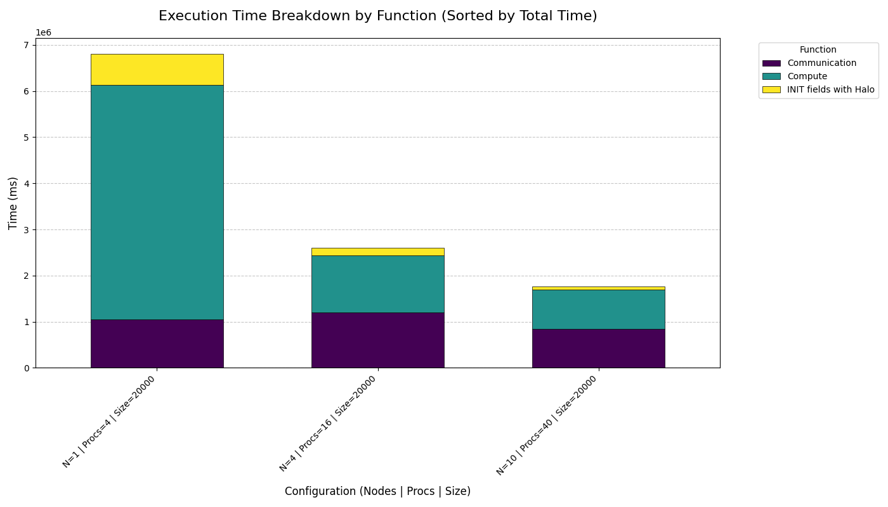

# jacobi-poisson-solver

The same 2-D Laplace problem solved four ways — hybrid MPI+OpenMP, the same thing with parallel HDF5
checkpointing, an OpenACC GPU port, and an NVSHMEM version — to see how each parallel model behaves
when you actually scale it, and what it costs to write files while you do.

**Stack:** C++20 · MPI · OpenMP · OpenACC · NVSHMEM · HDF5 · CMake-free Makefile builds · Docker ·
Nsight Systems · SLURM

**Where it ran:** Leonardo at CINECA — DCGP partition for CPU runs (112 cores per node, 2× Intel
Sapphire Rapids) and Booster for GPU runs (4× A100 64 GB per node, 200 Gbps HDR InfiniBand). Up to 10
nodes / 1120 cores on CPU, up to 40 A100s on GPU.

## The problem

Jacobi iteration on a 2-D grid: every cell becomes the average of its four neighbours, repeat until it
relaxes. It's the standard model problem for stencil codes — trivial arithmetic, heavy memory traffic,
and a halo exchange every single step, so it stresses exactly the things that matter when you scale.

```
u_new[i][j] = 0.25 * (u_old[i-1][j] + u_old[i+1][j] + u_old[i][j-1] + u_old[i][j+1])
```

| | |
|---|---|
| Precision | `double` (`CMesh<double>`), 8 bytes |
| Decomposition | 1-D row-block across MPI ranks, one halo row each side |
| Halo exchange | Custom MPI derived datatypes (`mpi_dt.hpp`) |
| Arithmetic intensity | 5 flop per cell, ≥16 B compulsory traffic → **0.31 flop/byte** |

That last number is the whole story: this kernel is bandwidth-bound, not compute-bound. Nothing below
is limited by how fast the FPUs go.

## The four variants

| Directory | Model | What it adds |
|---|---|---|
| [`mpi-openmp/`](mpi-openmp/) | MPI + OpenMP | Baseline hybrid. `#pragma omp parallel for collapse(2) schedule(static)` over the stencil |
| [`mpi-openmp-hdf5/`](mpi-openmp-hdf5/) | MPI + OpenMP + HDF5 | Collective parallel writes to a single shared `.h5` file at a configurable interval |
| [`mpi-openacc/`](mpi-openacc/) | MPI + OpenACC | GPU offload with explicit data regions; halos exchanged straight from device memory |
| [`nvshmem/`](nvshmem/) | NVSHMEM | GPU-initiated communication — halo exchange without returning to the host or to MPI |

The OpenACC version uses `#pragma acc host_data use_device(...)` around the exchange, so GPU-aware MPI
moves halo buffers device-to-device instead of staging through host memory.

## CPU scaling — N = 10,000², 1000 steps

500 GFLOP of work, two 0.75 GiB fields. Times are the best configuration at each node count.

| Nodes | Cores | Best config | Time | GFLOP/s | Speedup |
|---:|---:|---|---:|---:|---:|
| 1 | 112 | 28 ranks × 4 threads | 16.89 s | 29.6 | 1× |
| 2 | 224 | 112 ranks × 2 threads | 8.62 s | 58.0 | 1.96× |
| 8 | 896 | 224 ranks × 4 threads | 2.21 s | 225.9 | 7.6× |
| 10 | 1120 | 280 ranks × 4 threads | 1.78 s | 280.4 | **9.5×** |

9.5× on 10× the hardware — 95% parallel efficiency out to 1120 cores.



**How you split ranks and threads is worth 2× — consistently.** At every single node count, the best
configuration beats the worst by almost exactly the same factor:

| Nodes | Best | Worst | Spread |
|---:|---|---|---:|
| 1 | 28×4 — 16.89 s | 2×56 — 34.58 s | 2.05× |
| 2 | 112×2 — 8.62 s | 4×56 — 17.65 s | 2.05× |
| 8 | 224×4 — 2.21 s | 16×56 — 4.51 s | 2.04× |
| 10 | 280×4 — 1.78 s | 20×56 — 2.63 s | 1.48× |

Same nodes, same cores, same code — 2× apart. Few ranks with many threads always loses, because a rank
spanning both sockets keeps touching memory attached to the other one. Many ranks with 2–4 threads each
keeps every thread on its own NUMA domain. All the raw runs are in
[`results/cpu/combined.dat`](results/cpu/combined.dat).

## Parallel I/O — what checkpointing actually costs

The HDF5 variant writes every rank's slab into one shared file collectively, at a configurable step
interval. 27 configurations, four latency components:


**Writing less often helps roughly linearly.** Same 8-node, 8-ranks × 14-thread configuration:

| Write every | I/O time | Solve time |
|---:|---:|---:|
| 500 steps | 3155 ms | 4359 ms |
| 1000 steps | 2555 ms | 4369 ms |
| 2000 steps | 1411 ms | 4384 ms |

Solve time doesn't move — the writes aren't perturbing the compute, they're just additive.

**But more ranks means more I/O contention, and that flips which configuration is fastest.** At 8 nodes,
writing every 500 steps:

| Ranks/node | Solve | I/O | Total |
|---:|---:|---:|---:|
| 2 | 5126 ms | 3060 ms | 8186 ms |
| 4 | 4694 ms | 2973 ms | 7666 ms |
| **8** | 4359 ms | 3155 ms | **7514 ms** |
| 28 | 4055 ms | 4222 ms | 8277 ms |
| 56 | **3999 ms** | 6071 ms | 10071 ms |

56 ranks/node has the fastest compute of any configuration and the slowest total by 34%. More ranks
means more concurrent writers hitting the parallel filesystem, and past about 8 ranks per node that
contention grows faster than the compute savings.

**Tuning on compute time alone picks the wrong configuration.** You have to measure the I/O.

## GPU scaling — N = 20,000², 1000 steps

Four times the grid of the CPU runs — 2.0 TFLOP, two 2.98 GiB fields. Not comparable to the CPU numbers
above; different problem size.

| GPUs | Nodes | Time | GFLOP/s | Speedup | Efficiency | Field per GPU |
|---:|---:|---:|---:|---:|---:|---:|
| 4 | 1 | 6.695 s | 299 | 1× | 100% | 1.49 GiB |
| 8 | 2 | 4.025 s | 497 | 1.66× | 83% | 0.75 GiB |
| 16 | 4 | 2.694 s | 742 | 2.49× | 62% | 0.37 GiB |
| 40 | 10 | 1.887 s | 1060 | 3.55× | 36% | 0.15 GiB |



Efficiency falls off exactly as you'd expect from the breakdown: compute time drops with more GPUs but
communication stays roughly flat, so by 40 GPUs the halo exchange is most of the runtime and each card
only holds 150 MiB. Classic strong-scaling wall — the fix is a bigger problem, or overlapping the
exchange with compute.

Nsight Systems traces are in [`results/gpu/`](results/gpu/), collected with
[`scripts/slurm/nsys_profile.sh`](scripts/slurm/nsys_profile.sh).

## Build and run

Each variant is standalone. All of them read a plain text input file from [`input/`](input/) and take
the same parameters: grid size, corner value, initial fill, step count.

**MPI + OpenMP**

```bash
mpic++ -O3 -std=c++20 -fopenmp -Impi-openmp/include mpi-openmp/src/main.cpp -o jacobi.x
OMP_NUM_THREADS=4 mpirun -n 28 ./jacobi.x input/mpi_openmp.in
```

**MPI + OpenMP + HDF5**

```bash
mpic++ -O3 -std=c++20 -fopenmp -Impi-openmp-hdf5/include \
  -I${HDF5_INCLUDE} -L${HDF5_LIB} -lhdf5_cpp -lhdf5 \
  mpi-openmp-hdf5/src/main.cpp -o jacobi_io.x
OMP_NUM_THREADS=4 mpirun -n 8 ./jacobi_io.x input/mpi_openmp_hdf5.in
h5ls -r files/jacobi.h5      # inspect the output
```

**MPI + OpenACC** — needs the NVIDIA HPC SDK.

```bash
mpic++ -O3 -std=c++20 -acc -gpu=cc80 -Minfo=accel -Impi-openacc/include \
  mpi-openacc/src/main.cpp -o jacobi_gpu.x
mpirun -n 4 ./jacobi_gpu.x input/mpi_openacc.in
```

A [`Dockerfile`](mpi-openacc/Dockerfile) is included for the OpenACC build if you'd rather not set the
toolchain up locally.

SLURM scripts for all of them are in [`scripts/slurm/`](scripts/slurm/). Output goes to `files/` and
can be animated with [`results/analysis/animate_jacobi.gp`](results/analysis/animate_jacobi.gp).

## Known issue

The timing header reports `duration_cast<std::chrono::microseconds>` but prints the unit as `ms`. Every
number in [`results/cpu/`](results/cpu/) and [`results/gpu/`](results/gpu/) is therefore in
**microseconds** despite the label — cross-checked against the wall-clock stamps in the same files, and
converted correctly in every table above. Worth fixing in `timer.hpp`; left as-is here so the published
numbers match the raw output.

## Layout

```
mpi-openmp/            MPI + OpenMP baseline
mpi-openmp-hdf5/       + collective HDF5 checkpointing
mpi-openacc/           GPU offload, + Dockerfile
nvshmem/               GPU-initiated halo exchange
input/                 run configurations
scripts/slurm/         batch scripts, Nsight profiling
results/
  cpu/  io/  gpu/      raw timing output
  plots/               figures used above
  analysis/            plotting and animation scripts
```

Each variant keeps its own `include/` — `mesh.hpp` (the solver and halo logic), `mpi_dt.hpp` (derived
datatypes), `timer.hpp`, `printer.hpp`, and for the HDF5 build `parallel_jacobi_write.hpp`. Regression
tests are in each variant's `tests/`.

## Where this came from

Coursework for the Master in High Performance Computing (ICTP / SISSA, Trieste), 2025–26 — the hybrid
and I/O versions from *P1.5 Parallel Programming*, the GPU versions from *P1.7 GPU Programming* and
*P2.2 GPU Programming 2*. Parts have been public since June 2026 in
[`prabhkodes/heterogenous_computing`](https://github.com/prabhkodes/heterogenous_computing) and
[`prabhkodes/file_io_stuff`](https://github.com/prabhkodes/file_io_stuff). The course repositories
belong to SISSA and are private.
